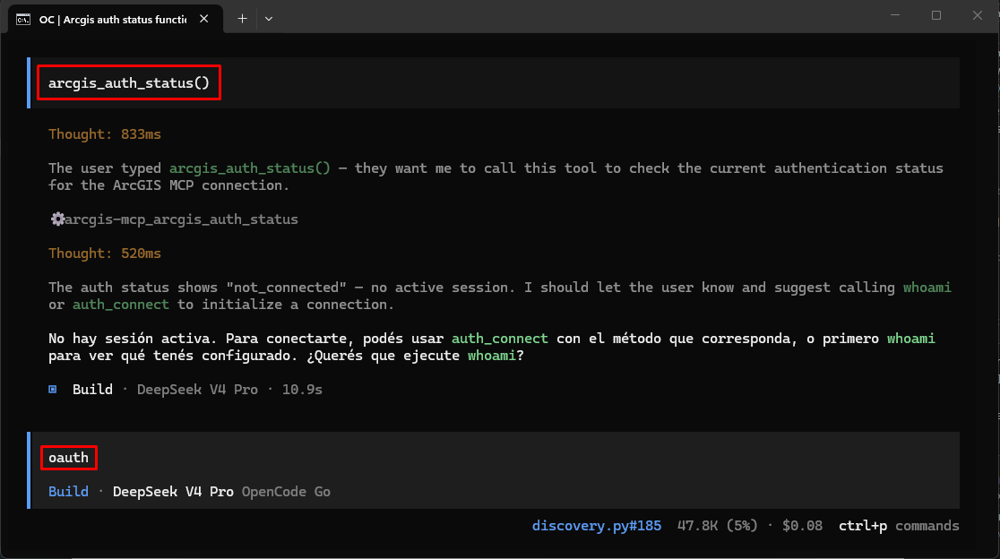
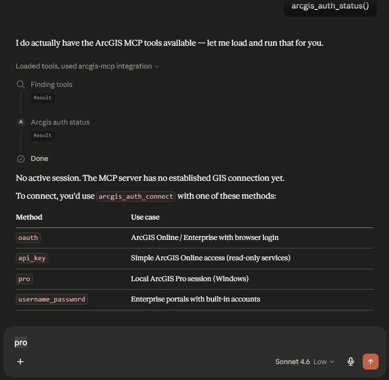
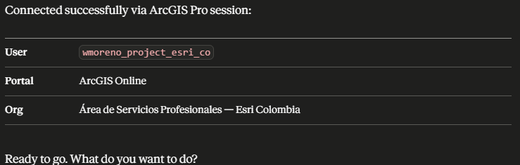

# ArcGIS MCP - Servidor Unificado

Servidor MCP para **ArcGIS Online** y **ArcGIS Enterprise** que combina:
- ✅ Administración de usuarios, grupos y compartición
- ✅ Gestión completa de items (publicar, exportar, mover, clonar)
- ✅ Geoprocesamiento dinámico
- ✅ Consulta y edición de Feature Layers, Tables y FeatureCollections
- ✅ Administración de ArcGIS Server (servicios, logs, máquinas) — Enterprise
- ✅ Logs del portal con filtros avanzados — Enterprise
- ✅ **152 tools MCP** organizadas por módulo

> **Nota**: Funciona tanto con ArcGIS Online como con ArcGIS Enterprise. Algunas funciones específicas (webhooks, notebooks, servidores federados) solo están disponibles en Enterprise.

## Inicio rápido

**3 pasos para empezar:**

1. **Descarga o clona** esta carpeta (`arcgis-mcp`)
2. **Ejecuta el instalador** — clic derecho sobre `install.ps1` → *Ejecutar con PowerShell*  
   Detecta Python automáticamente y aplica esta regla de compatibilidad:
   - **ArcGIS Pro >= 3.3** → usa el Python del entorno de Pro con soporte pleno de `GIS("Pro")`
   - **ArcGIS Pro < 3.3** → usa automáticamente un Python externo compatible con MCP
   - **Sin ArcGIS Pro** → usa Python externo del sistema o lo instala vía `winget`
   Luego instala dependencias y configura los IDEs detectados (VS Code, Claude Desktop, Cursor, Claude Code, Codex, OpenCode, OpenClaw).
3. **Configurá la autenticación** y reiniciá el IDE:
   - **Con ArcGIS Pro 3.3+**: abrí Pro, conectate a tu portal — listo.
   - **Con ArcGIS Pro < 3.3**: el instalador usará Python externo, así que configurá `.env` o usá otro método de autenticación distinto de `GIS("Pro")`.
   - **Sin ArcGIS Pro**: editá el `.env` con tu método preferido (OAuth2, API Key, perfil o usuario/contraseña). Ver sección [Autenticación](#autenticación).

Proba con: *"¿con qué usuario estoy conectado?"*

> Sin ArcGIS Pro: `python test_oauth.py` para verificar la conexión.  
> Con ArcGIS Pro: `python test_pro.py`.

---

## Autenticación

El servidor intenta conectarse automáticamente en este orden:

1. **🖥️ ArcGIS Pro activo** (`GIS("Pro")`) 
    - Usa la sesión ya autenticada en ArcGIS Pro
    - El usuario YA debe haber iniciado sesión en Pro
    - No requiere .env si Pro está abierto y conectado
    - **Disponible con soporte pleno desde ArcGIS Pro 3.3**
    - **Ideal para**: Desarrollo local con Pro 3.3+ instalado

> **Compatibilidad importante**
> - **ArcGIS Pro >= 3.3**: el instalador usa el entorno Python de Pro y habilita `GIS("Pro")`.
> - **ArcGIS Pro < 3.3**: el instalador usa automáticamente un Python externo compatible con MCP y deshabilita el modo `GIS("Pro")` por compatibilidad.
> - En ese caso, usa OAuth2, API Key, perfil, token o usuario/contraseña.

2. **🌐 OAuth2 interactivo** (Abre navegador)
   - Variables: `ARCGIS_USE_OAUTH=true`
   - Abre el navegador para que el usuario se autentique
   - El usuario ingresa sus credenciales en el portal ArcGIS
   - Genera token automáticamente tras autenticación exitosa
   - **Ideal para**: Producción, usuarios finales, apps distribuidas
   - Ejemplo:
     ```env
     ARCGIS_USE_OAUTH=true
     ARCGIS_URL=https://www.arcgis.com  # O tu portal
     ARCGIS_CLIENT_ID=mi_app_id         # Opcional
     ```

3. **🔑 Perfil nombrado** - Variable `ARCGIS_PROFILE` (recomendado para desarrollo)
   - Usa credenciales guardadas en el keyring del sistema
   - Más seguro que usuario/contraseña en .env

4. **🔓 API Key** - Variable `ARCGIS_API_KEY` (Enterprise 11.4+ o AGOL)
   - Tokens de larga duración (hasta 1 año)

5. **🎫 Token** - Variable `ARCGIS_TOKEN` (temporal)
   - Para tokens generados externamente

6. **👤 Usuario/Contraseña** - Variables `ARCGIS_URL`, `ARCGIS_USER`, `ARCGIS_PASS`
   - Menos seguro, solo para desarrollo local

## 📦 Instalación

### Opción 1: Setup automático (Recomendado)
```bash
python setup.py
```
Este script ejecuta instalación inteligente + verificación automáticamente.

> **Importante**
> `setup.py`, `setup.ps1` e instalación manual con `pip` asumen que YA estás usando un runtime compatible:
> - Python externo **3.11+**, o
> - Python de **ArcGIS Pro 3.3+**.
>
> Si tienes **ArcGIS Pro < 3.3**, usa `install.ps1`, que selecciona automáticamente un Python externo compatible con MCP.

### Opción 2: Instalación manual
```bash
# Solo instala paquetes faltantes (no reinstala los existentes)
python install_requirements.py

# Verificar que todo quedó bien
python verify_installation.py
```

`install_requirements.py` ahora ejecuta una validación post-instalación del runtime crítico (`arcgis`, `fastmcp`, `dotenv` y dependencias MCP relacionadas). Además, si el `arcgis` ya instalado declara `pyarrow` como dependencia runtime, el instalador lo incorpora de forma proactiva (o corrige su versión) antes de la validación final. Si el entorno queda inconsistente — por ejemplo, una instalación contaminada de ArcGIS Pro o un `pyarrow` requerido pero no importable — el script termina con error. `pip check` se reporta también, pero los conflictos ajenos al runtime de este proyecto quedan como advertencias no bloqueantes.

`install_requirements.py` selecciona automáticamente un perfil de compatibilidad según la versión real de Python activa:
- `constraints-py311.txt`
- `constraints-py312.txt`
- `constraints-py313plus.txt`

Así evita resolver dependencias de forma ciega cuando el runtime cambia entre ArcGIS Pro 3.3+ y Python externos modernos.

### Opción 3: pip tradicional (Instala todos los paquetes requeridos)
```bash
pip install -r requirements.txt
```

## ⚙️ Configuración

### 🖥️ Modo 1: ArcGIS Pro (Sin configuración)
Si tienes **ArcGIS Pro 3.3 o superior** abierto y conectado, **no necesitas .env**. El servidor detectará automáticamente tu sesión activa.

```bash
# 1. Abre ArcGIS Pro y conéctate a tu portal
# 2. Ejecuta el servidor
python arcgis_mcp.py
```

Si tu instalación es **ArcGIS Pro < 3.3**, `install.ps1` configurará automáticamente un Python externo compatible con MCP. En esa modalidad debes usar `.env` o métodos de autenticación no-Pro.

### 🌐 Modo 2: OAuth2 Interactivo (Recomendado para producción)
Crea un archivo `.env`:

```env
ARCGIS_USE_OAUTH=true
ARCGIS_URL=https://www.arcgis.com  # O tu portal Enterprise

# Opcional: Client ID personalizado (si tienes una app registrada)
# ARCGIS_CLIENT_ID=tu_app_client_id
```

Al ejecutar el servidor, se abrirá automáticamente el navegador para que el usuario se autentique. El token se genera y almacena automáticamente.

### 🔑 Modo 3: Perfil nombrado (Desarrollo)
Primero crea un perfil con credenciales:

```python
from arcgis.gis import GIS
gis = GIS("https://mi-portal.com/portal", username="mi_usuario")
# Ingresa tu contraseña cuando lo pida
gis.users.me.username  # Verifica que funciona
# Las credenciales se guardan en el keyring del sistema
```

Luego en `.env`:
```env
ARCGIS_PROFILE=mi_perfil
```

### 📋 Otras opciones

**API Key:**
```env
ARCGIS_URL=https://mi-portal.com/portal
ARCGIS_API_KEY=tu_api_key_aqui
```

**Usuario/Contraseña:**
```env
ARCGIS_URL=https://mi-portal.com/portal
ARCGIS_USER=mi_usuario
ARCGIS_PASS=mi_contraseña
```

**Guardarrailes de seguridad:**
```env
# Habilitar operaciones de escritura (crear, editar, eliminar)
ARCGIS_WRITE_ENABLED=true  # false por defecto
```

## 🎯 Uso Recomendado: MCP Puro

**El servidor está diseñado para usarse como MCP puro (sin HTTP) directamente desde cualquier cliente compatible:**

> En todos los casos, reemplaza `PYTHON_PATH_EXE` con el ejecutable de tu entorno ArcGIS Pro  
> (ej: `C:\...\arcgispro-py3-clone\python.exe`) y `REPO_PATH` con la ruta al archivo `arcgis_mcp.py`.

---

### Claude Desktop

Archivo de configuración:
- **Windows:** `%APPDATA%\Claude\claude_desktop_config.json`
- **macOS:** `~/Library/Application Support/Claude/claude_desktop_config.json`

```json
{
  "mcpServers": {
    "arcgis-mcp": {
      "command": "PYTHON_PATH_EXE",
      "args": ["REPO_PATH\\arcgis_mcp.py"],
      "env": {
        "ARCGIS_WRITE_ENABLED": "true"
      }
    }
  }
}
```

Reiniciar Claude Desktop después de editar.

---

### Claude Code (CLI)

Claude Code maneja tres scopes. El más práctico es `user` (disponible en todos tus proyectos):

```bash
claude mcp add --scope user --env ARCGIS_WRITE_ENABLED=true --transport stdio arcgis-mcp -- "PYTHON_PATH_EXE" "REPO_PATH/arcgis_mcp.py"
```

Claude Code escribe la configuración automáticamente — no hace falta editar JSON a mano.

| Scope | Archivo | Disponibilidad |
|---|---|---|
| `local` (default) | `~/.claude.json` | Solo vos, en el proyecto actual |
| `project` | `.mcp.json` en la raíz | Todo el equipo vía git |
| `user` | `~/.claude.json` | Solo vos, en todos los proyectos |

Para ver los servidores configurados: `claude mcp list`

---

### Cursor

Archivo: `~/.cursor/mcp.json` (global) o `.cursor/mcp.json` (solo este proyecto).

```json
{
  "mcpServers": {
    "arcgis-mcp": {
      "command": "PYTHON_PATH_EXE",
      "args": ["REPO_PATH\\arcgis_mcp.py"],
      "env": {
        "ARCGIS_WRITE_ENABLED": "true"
      }
    }
  }
}
```

Cursor recarga la configuración automáticamente; no hace falta reiniciar.

---

### OpenCode

Archivo global: `~/.config/opencode/opencode.json`  
Archivo de proyecto: `opencode.json` en la raíz del proyecto.

```json
{
  "$schema": "https://opencode.ai/config.json",
  "mcp": {
    "arcgis-mcp": {
      "type": "local",
      "command": ["PYTHON_PATH_EXE", "REPO_PATH/arcgis_mcp.py"],
      "environment": {
        "ARCGIS_WRITE_ENABLED": "true"
      }
    }
  }
}
```

> **Atención:** La clave correcta es `"environment"` (no `"env"`). OpenCode ignora `"env"` silenciosamente.

---



Puede usar el metodo **pro**. Si no, puede usar este metodo pero debe estar diligenciadas las variables: **ARCGIS_URL, ARCGIS_CLIENT_ID** en el archivo .env

### Codex CLI (OpenAI)

Archivo global: `~/.codex/config.toml`  
Archivo de proyecto: `.codex/config.toml` en la raíz del proyecto.

> **Atención:** Codex usa **TOML**, no JSON.

```toml
[mcp_servers.arcgis-mcp]
command = "PYTHON_PATH_EXE"
args = ["REPO_PATH/arcgis_mcp.py"]

[mcp_servers.arcgis-mcp.env]
ARCGIS_WRITE_ENABLED = "true"
ARCGIS_PROFILE = "Pro"
```

O via CLI (escribe en `config.toml` automáticamente):
```bash
codex mcp add arcgis-mcp --env ARCGIS_WRITE_ENABLED=true -- PYTHON_PATH_EXE REPO_PATH/arcgis_mcp.py
```


---

### Kiro (AWS)

Archivo: `.kiro/settings/mcp.json` dentro del workspace.

```json
{
  "mcpServers": {
    "arcgis-mcp": {
      "command": "PYTHON_PATH_EXE",
      "args": ["REPO_PATH\\arcgis_mcp.py"],
      "env": {
        "ARCGIS_WRITE_ENABLED": "true"
      },
      "autoApprove": ["whoami", "content_search", "user_list", "group_list"]
    }
  }
}
```

El campo `autoApprove` es opcional — lista las tools que Kiro ejecuta sin pedir confirmación al usuario.

---

**copilot:**


📖 **Guía completa:** esta misma documentación en este README.

---

## 🚀 Ejecución

### Modo 1: MCP Puro (Recomendado) ✅





**Para usar desde Claude Desktop o VS Code:**
- No ejecutar manualmente
- El cliente MCP (Claude/VS Code) inicia y gestiona el servidor automáticamente
- Ver configuración en la sección anterior

**Para testing local:**
```powershell
cd D:\Dev\IA\MCPs\arcgis-mcp
python arcgis_mcp.py
```
El servidor queda esperando mensajes JSON-RPC en stdin/stdout.

### Modo 2: HTTP Server (Solo para Testing/Dev) 🧪

```powershell
python arcgis_mcp.py --http
```

**Swagger UI:** http://localhost:8080/docs  
**ReDoc:** http://localhost:8080/redoc

> ⚠️ Modo de desarrollo únicamente. No usar en producción.

### Modo 3: SSE (HTTP+SSE para clientes remotos)

```powershell
python arcgis_mcp.py --sse
python arcgis_mcp.py --sse --port 9090  # puerto personalizado
```

Expone el MCP sobre HTTP+SSE en `http://0.0.0.0:8080/sse`. Requiere Entra ID configurado para validar tokens Bearer (variables `AZURE_TENANT_ID` y `AZURE_CLIENT_ID_MCP`). Si esas variables no están presentes, arranca sin autenticación (útil para pruebas internas).

### Setup Inicial (Primera Vez)

**Windows:**
```powershell
cd D:\Dev\IA\MCPs\arcgis-mcp
.\setup.ps1
```

**Linux/Mac:**
```bash
cd ~/arcgis-mcp
python setup.py
```

## 🧪 Pruebas de Autenticación

Antes de ejecutar el servidor completo, puedes probar tu configuración de autenticación:

### Probar conexión con ArcGIS Pro
```bash
python test_pro.py
```
Verifica que tu sesión de Pro esté activa y funcional.

### Probar OAuth2 interactivo
```bash
# ArcGIS Online
python test_oauth.py

# Portal Enterprise personalizado
python test_oauth.py --url https://mi-portal.com/portal

# Con Client ID personalizado
python test_oauth.py --url https://mi-portal.com/portal --client-id mi_app_id
```

Estos scripts te ayudan a diagnosticar problemas de autenticación antes de ejecutar el servidor MCP completo.

## 🧪 Uso con agentes IA

Este MCP está diseñado para ser consumido por:
- GitHub Copilot
- Cursor
- Claude Code
- VS Code
- OpenCode
- Cualquier cliente MCP compatible

### 🤖 Agente especializado: `arcgis-apyt-dev`

El repositorio incluye un agente experto en ArcGIS API for Python que se instala automáticamente con `install.ps1` en cada IDE detectado.

#### Capacidades

El agente opera como orquestador con 4 niveles de escalada:

```
1. Usa las 152 tools del MCP directamente cuando cubren la tarea
2. Si el MCP no alcanza → busca el path correcto en el API con arcgis_docs_* y ejecuta Python
3. Si la operación es genérica y reutilizable → escribe un nuevo @mcp.tool() en tools/*.py
4. Solo responde "no es posible" cuando los 3 caminos anteriores fallan
```

#### Instalación manual (si no usaste `install.ps1`)

| IDE | Archivo fuente | Destino |
|-----|---------------|---------|
| VS Code / Copilot | `agents/arcgis-apyt-dev.vscode.agent.md` | `%APPDATA%\Code\User\prompts\` |
| Claude Code | `agents/arcgis-apyt-dev.claude.md` | `~/.claude/agents/` |
| Cursor | `agents/arcgis-apyt-dev.cursor.mdc` | `~/.cursor/rules/` |
| Codex CLI | `agents/arcgis-apyt-dev.codex.md` | Append a `~/.codex/AGENTS.md` |

#### Ejemplos de uso del agente

```
"Descarga todos los attachments del Feature Layer de inspecciones"
→ No existe tool MCP → agente busca FeatureLayer.attachments.get_list() y ejecuta Python directo

"Necesito un tool MCP para clonar grupos entre portales"
→ Agente verifica la API, escribe el @mcp.tool() en tools/users_groups.py y lo registra

"Lista todos los servicios de imagen del Enterprise"
→ server_services_list(service_type="ImageServer") — MCP tool directa
```

### Ejemplos de prompts

#### 🔍 GIS / Portal

```
"¿Con qué usuario estoy conectado y qué privilegios tengo?"
→ whoami()

"Muestra las propiedades del portal (versión, idioma, región)"
→ gis_properties()

"¿Qué versión tiene este ArcGIS Enterprise?"
→ gis_version()
```

#### 📦 Contenido — ContentManager

```
"Busca todos los Feature Layers con la palabra 'catastro'"
→ content_search(query="catastro", item_type="Feature Layer", max_items=50)

"¿Cuáles son los items que ocupan más de 500 MB?"
→ content_find_large(min_mb=500)
```

#### 📄 Items — Item

```
"Mostrame todos los detalles del item con ID abc123"
→ item_get(item_id="abc123")

"Exporta ese item a formato Shapefile"
→ item_export(item_id="abc123", export_format="Shapefile", title="catastro_shp")

"Mové el item abc123 a la carpeta 'Proyectos 2024'"
→ item_move(item_id="abc123", folder="Proyectos 2024")

"Clona el item abc123 en la cuenta del usuario jperez"
→ item_clone(item_id="abc123", owner="jperez")

"¿De qué otros items depende el item abc123?"
→ item_dependent_upon(item_id="abc123")

"Protege el item abc123 para que no se pueda borrar"
→ item_protect(item_id="abc123")

"Descarga el thumbnail del item abc123"
→ item_thumbnail(item_id="abc123", save_path="C:/tmp/thumb.png")
```

#### 👤 Usuarios — UserManager / User

```
"Lista todos los usuarios del portal"
→ user_list(query="*", max_users=200)

"Muestra el perfil y roles del usuario jperez"
→ user_get(username="jperez")

"Desactiva la cuenta del usuario jperez"
→ user_disable(username="jperez")

"Cambia el rol de jperez a 'publisher'"
→ user_set_role(username="jperez", role="publisher")

"¿Qué contenido tiene publicado el usuario jperez?"
→ user_content(username="jperez")
```

#### 👥 Grupos — GroupManager / Group

```
"Lista todos los grupos del portal"
→ group_list(query="*", max_groups=100)

"¿Quiénes son los miembros del grupo con ID grp456?"
→ group_members(group_id="grp456")

"Agrega a jperez y mgarcia al grupo grp456"
→ group_add_users(group_id="grp456", usernames=["jperez", "mgarcia"])

"¿Qué items están compartidos en el grupo grp456?"
→ group_content(group_id="grp456", max_items=100)

"Crea un grupo llamado 'Cartografía' con etiquetas gis, mapas"
→ group_create(title="Cartografía", description="Grupo de cartografía", tags=["gis", "mapas"])
```

#### 🔗 Compartición — SharingManager

```
"¿Quién tiene acceso al item abc123?"
→ share_get_access(item_id="abc123")

"Configura público el item abc123"
→ share_set_access(item_id="abc123", access="public")

"Comparte el item abc123 con los grupos grp456 y grp789"
→ share_group_add(item_id="abc123", group_ids=["grp456", "grp789"])

"¿Cuáles son los items públicos del usuario jperez?"
→ share_audit_by_owner(username="jperez")

"Configura privados todos estos items de golpe: abc123, def456, ghi789"
→ share_bulk_set_access(item_ids=["abc123", "def456", "ghi789"], access="private")
```

#### ⚙️ Geoprocesamiento

```
"¿Qué tools expone el GP service en esta URL?"
→ gp_discover(gp_url_or_item="https://mi-server/arcgis/rest/services/Recorte/GPServer")

"Ejecuta la tool 'Clip' con esa capa de entrada"
→ gp_run(gp_url_or_item="https://…/Recorte/GPServer", tool_name="Clip",
         params={"input_features": "https://…/FeatureServer/0", "clip_features": "https://…/FeatureServer/1"})

"Busca GP services relacionados con 'buffer' en el portal"
→ gp_search_services(keywords="buffer", max_results=10)

"Muestra los parámetros y descripción de la tool 'Buffer'"
→ gp_tool_help(gp_url_or_item="https://…/GPServer", tool_name="Buffer")
```

#### 🗂️ Features — FeatureLayer

```
"¿Qué campos tiene el Feature Layer en esta URL?"
→ fl_fields(layer_ref="https://mi-server/arcgis/rest/services/Catastro/FeatureServer/0")

"Consulta los predios con área mayor a 5000 m²"
→ fl_query_advanced(layer_ref="https://…/FeatureServer/0",
                    where="AREA > 5000", out_fields=["OBJECTID", "PROPIETARIO", "AREA"],
                    return_geometry=True)

"¿Qué operaciones soporta ese layer (edit, query, etc.)?"
→ fl_capabilities(layer_ref="https://…/FeatureServer/0")

"Calcula el campo 'ESTADO' como 'Activo' para todos los features"
→ fl_calculate(layer_ref="https://…/FeatureServer/0",
               where="1=1", calc_expression=[{"field": "ESTADO", "value": "Activo"}])
```

#### 🗂️ Features — Feature / Table / FLC / FeatureSet / FeatureCollection

```
"Dame el feature con OBJECTID=42 de esa capa"
→ feature_get(layer_ref="https://…/FeatureServer/0", object_id=42)

"Consulta la tabla de incidentes y devolve los últimos 50 registros"
→ table_query(layer_ref="https://…/FeatureServer/1",
              where="1=1", max_records=50)

"¿Cuáles son los campos de esa tabla?"
→ table_fields(layer_ref="https://…/FeatureServer/1")

"Describí la estructura completa del FeatureLayerCollection"
→ flc_describe(layer_ref="https://…/FeatureServer")

"Calcula estadísticas (count, avg de AREA) de esta consulta"
→ fset_statistics(layer_ref="https://…/FeatureServer/0",
                  where="MUNICIPIO = 'Bogotá'",
                  stat_fields=[{"statisticType": "avg", "onStatisticField": "AREA", "outStatisticFieldName": "avg_area"}])

"Convertí los resultados de esa consulta a GeoJSON"
→ fset_to_geojson(layer_ref="https://…/FeatureServer/0", where="ESTADO = 'Activo'")
```

#### 📋 Logs del Portal — Enterprise

```
"Muestra los últimos WARNING de los logs del portal"
→ portal_logs_query(level="WARNING", page_size=200)

"Dame los errores del portal entre el 1 y el 7 de junio"
→ portal_logs_query(start_time="2025-06-01T00:00:00", end_time="2025-06-07T23:59:59",
                    level="SEVERE", page_size=500)

"¿Cuál es la configuración actual de retención de logs del portal?"
→ portal_logs_settings()

"Cambia el nivel de log del portal a WARNING"
→ portal_logs_settings_update(log_level="WARNING", dry_run=False)
```

#### 🔧 Admin Enterprise — misc

```
"¿Qué licencias de ArcGIS Pro están disponibles en el portal?"
→ admin_licenses()

"¿Hay servicios detenidos o con errores en este momento?"
→ admin_services_health()

"Lista todos los servidores federados al portal"
→ admin_servers_list()
```

#### 🖥️ ArcGIS Server — Enterprise

```
"Lista todos los servicios del servidor de hosting"
→ server_services_list(server_role="HOSTING_SERVER")

"¿Cuál es el estado y métricas del servicio 'Catastro/MapServer'?"
→ server_service_status(service_name="Catastro/MapServer", server_role="HOSTING_SERVER")

"Reinicia el servicio 'Catastro/MapServer' (primero en dry-run)"
→ server_service_restart(service_name="Catastro/MapServer", dry_run=True)
→ server_service_restart(service_name="Catastro/MapServer", dry_run=False)

"Muestra los errores de los últimos logs del servidor"
→ server_logs_query(log_level="SEVERE", num_messages=200, server_role="HOSTING_SERVER")

"¿Qué máquinas forman parte del clúster del servidor?"
→ server_machines_list(server_role="HOSTING_SERVER")

"Dame el hardware de la máquina ARCGIS-SRV01 (CPU, RAM, disco)"
→ server_machine_hardware(machine_name="ARCGIS-SRV01", server_role="HOSTING_SERVER")

"Lista las carpetas disponibles en el Services Directory del servidor"
→ server_services_folders(server_role="HOSTING_SERVER")

"¿Qué servicios hay en la carpeta 'Utilities' del servidor?"
→ server_services_directory_list(folder="Utilities", server_role="HOSTING_SERVER")
```

## 🛠️ Tools disponibles

> **Total: 105 tools MCP** organizadas por módulo API de ArcGIS Python

### 🔍 GIS / Portal (3)
- `whoami()` — Identidad, plataforma, privilegios de la sesión activa
- `gis_properties()` — Propiedades del portal (GIS.properties)
- `gis_version()` — Versión del portal o ArcGIS Enterprise

### 📦 Contenido — ContentManager (2)
- `content_search(query, item_type, max_items)` — Buscar items en el portal
- `content_find_large(min_mb)` — Identificar items que superan un tamaño en MB

### 📄 Items — Item (21)
- `item_get(item_id)` — Detalles completos de un item
- `item_update(item_id, ...)` — Actualizar metadata (WRITE)
- `item_protect(item_id)` / `item_unprotect(item_id)` — Protección contra eliminación (WRITE)
- `item_metadata(item_id, format)` — Metadata en JSON o XML
- `item_download(item_id, save_path)` — Descargar datos del item
- `item_delete(item_id)` — Eliminar item (WRITE)
- `item_move(item_id, folder)` — Mover a carpeta (WRITE)
- `item_clone(item_id, ...)` — Clonar item (WRITE)
- `item_publish(item_id, ...)` — Publicar como servicio (WRITE)
- `item_export(item_id, ...)` — Exportar a formato (WRITE)
- `item_share(item_id, ...)` — Compartir con grupos/público (WRITE)
- `item_layers(item_id)` — Capas de un item de servicio
- `item_dependent_upon(item_id)` — Items de los que este depende
- `item_dependent_to(item_id)` — Items que dependen de este
- `item_related_items(item_id, rel_type)` — Items relacionados
- `item_reassign(item_id, target_owner)` — Reasignar propietario (WRITE)
- `item_get_data(item_id)` — Datos/JSON interno del item
- `item_thumbnail(item_id, save_path)` — Descargar thumbnail
- `item_add_comment(item_id, comment)` — Agregar comentario (WRITE)
- `item_resources(item_id)` — Recursos adjuntos al item

### 👤 Usuarios — UserManager / User (8)
- `user_list(query, max_users)` — Listar usuarios del portal
- `user_create(username, ...)` — Crear usuario (WRITE, Enterprise)
- `user_get(username)` — Detalles de un usuario
- `user_update(username, ...)` — Actualizar datos del usuario (WRITE)
- `user_disable(username)` — Desactivar cuenta (WRITE)
- `user_enable(username)` — Activar cuenta (WRITE)
- `user_set_role(username, role)` — Cambiar rol (WRITE)
- `user_content(username)` — Items del usuario

### 👥 Grupos — GroupManager / Group (8)
- `group_list(query, max_groups)` — Listar grupos
- `group_create(title, description, tags)` — Crear grupo (WRITE)
- `group_get(group_id)` — Detalles de un grupo
- `group_update(group_id, ...)` — Actualizar grupo (WRITE)
- `group_add_users(group_id, usernames)` — Agregar miembros (WRITE)
- `group_remove_users(group_id, usernames)` — Remover miembros (WRITE)
- `group_content(group_id, max_items)` — Items compartidos en el grupo
- `group_members(group_id)` — Miembros del grupo

### 🔗 Compartición — SharingManager (12)
- `share_get_access(item_id)` / `share_set_access(...)` / `share_status(item_id)` — Acceso de un item
- `share_bulk_set_access(item_ids, access)` — Cambio masivo de acceso (WRITE)
- `share_audit_public()` / `share_audit_by_owner(username)` — Auditoría de items públicos
- `share_group_add(item_id, group_ids)` / `share_group_remove(...)` / `share_group_list(item_id)` — Grupos de un item
- `share_group_replace(...)` / `share_group_copy(...)` / `share_group_audit(group_id)` — Operaciones de grupo avanzadas

### ⚙️ Geoprocesamiento (10)
- `gp_discover(gp_url_or_item)` — Descubrir tools de un GP Service
- `gp_run(...)` — Ejecutar tool sincrónicamente
- `gp_run_async(...)` — Ejecutar tool y esperar resultado
- `gp_tool_help(gp_url_or_item, tool_name)` — Parámetros y docstring de una tool
- `gp_search_services(keywords, max_results)` — Buscar GP services en el portal
- `gp_service_info(gp_url_or_item)` — Info REST del service
- `gp_linear_unit(distance, units)` — Construir LinearUnit
- `gp_data_file(url, item_id)` — Construir DataFile
- `gp_raster_data(url, item_id, format)` — Construir RasterData
- `gp_run_with_env(...)` — Ejecutar con arcgis.env (SR, extent, etc.)

### 🗂️ Features — FeatureLayer (6)
- `fl_fields(layer_ref)` — Campos del layer
- `fl_query_advanced(...)` — Consulta con filtros SQL y espaciales
- `fl_edit(...)` — Agregar/actualizar/eliminar features (WRITE)
- `fl_delete_by_query(...)` — Eliminar features por filtro (WRITE)
- `fl_calculate(...)` — Calcular campo (WRITE)
- `fl_capabilities(layer_ref)` — Capacidades del layer

### 🗂️ Features — Feature / Table / FeatureLayerCollection / FeatureSet / FeatureCollection (15)
- **Feature (3):** `feature_get`, `feature_get_value`, `feature_update`
- **Table (3):** `table_query`, `table_edit`, `table_fields`
- **FeatureLayerCollection (3):** `flc_describe`, `flc_update_definition`, `flc_truncate`
- **FeatureSet (3):** `fset_from_query`, `fset_statistics`, `fset_to_geojson`
- **FeatureCollection (3):** `fc_describe`, `fc_query`, `fc_to_feature_layer`

### 📋 Logs del Portal — Enterprise (4)
*Solo disponibles en ArcGIS Enterprise con credenciales de administrador.*
- `portal_logs_query(start_time, end_time, level, query_filter, ...)` — Consultar logs con filtros
- `portal_logs_clean()` — Limpiar todos los logs (WRITE, IRREVERSIBLE)
- `portal_logs_settings()` — Configuración actual (logLevel, logDir, retención)
- `portal_logs_settings_update(...)` — Actualizar configuración de logs (WRITE)

### 🔧 Admin Enterprise — misc (3)
*Solo disponibles en ArcGIS Enterprise.*
- `admin_licenses()` — Licencias de ArcGIS Pro disponibles
- `admin_services_health()` — Servicios detenidos o con errores
- `admin_servers_list()` — Servidores federados al portal

### 🖥️ ArcGIS Server — Enterprise (13)
*Solo disponibles en ArcGIS Enterprise. Prefijo: `server_`.*
- `server_list()` — Listar todos los servidores federados
- `server_services_list(folder, server_role)` — Servicios de un servidor
- `server_service_status(service_name, folder, server_role)` — Estado y métricas
- `server_service_start(...)` / `server_service_stop(...)` / `server_service_restart(...)` — Control (WRITE)
- `server_logs_query(...)` — Logs del servidor con filtros
- `server_logs_clean(server_role)` — Limpiar logs del servidor (WRITE)
- `server_machines_list(server_role)` — Máquinas del clúster
- `server_machine_hardware(machine_name, server_role)` — CPU, RAM, disco, SO
- `server_service_manifest(...)` — Manifest de recursos del servicio
- `server_services_directory_list(folder, server_role)` / `server_services_folders(server_role)` — Services Directory REST

---

## 📚 Ejemplos Python (modo HTTP)

```python
import requests

BASE = "http://localhost:8080/tools"

# Obtener identidad
resp = requests.post(f"{BASE}/whoami", json={})
print(resp.json())

# Buscar contenido
resp = requests.post(
    f"{BASE}/content_search",
    json={"query": "population", "item_type": "Feature Layer", "max_items": 10}
)
print(resp.json())

# Items grandes (> 200 MB)
resp = requests.post(f"{BASE}/content_find_large", json={"min_mb": 200})
print(resp.json())

# Miembros de un grupo
resp = requests.post(f"{BASE}/group_members", json={"group_id": "abc123"})
print(resp.json())

# Logs del portal (últimos WARNING)
resp = requests.post(
    f"{BASE}/portal_logs_query",
    json={"level": "WARNING", "page_size": 100}
)
print(resp.json())
```

## 🐛 Troubleshooting

**Error: "No se pudo conectar a ArcGIS"**
- Verifica que tengas al menos una credencial configurada
- Si usas Pro, verifica que esté abierto y conectado
- Si usas .env, verifica que las variables estén correctas

**Error: "Escritura deshabilitada"**
- Activa `ARCGIS_WRITE_ENABLED=true` en .env
- Las tools de escritura tienen `dry_run=True` por defecto como protección

**Error: "Solo disponible en ArcGIS Enterprise"**
- Algunas tools (webhooks, notebooks, servidores) solo funcionan en Enterprise
- Verifica tu plataforma con `whoami()`

## Ejemplo de consumo vía HTTP (FastAPI + MCP)

El servidor HTTP corre en http://localhost:8080 (modo `--http`).

### Python
```python
import requests

# Listar usuarios
resp = requests.post("http://localhost:8080/tools/user_list", json={"max_users": 50})
print(resp.json())

# Items del usuario
resp = requests.post("http://localhost:8080/tools/user_content", json={"username": "jsmith"})
print(resp.json())

# Estado de un servicio
resp = requests.post(
    "http://localhost:8080/tools/server_service_status",
    json={"service_name": "MyMapService", "server_role": "HOSTING_SERVER"}
)
print(resp.json())
```

### curl
```bash
curl -X POST http://localhost:8080/tools/whoami -H "Content-Type: application/json" -d '{}'
```

### Documentación interactiva

Abre en tu navegador:
- Swagger UI: http://localhost:8080/docs
- ReDoc: http://localhost:8080/redoc
